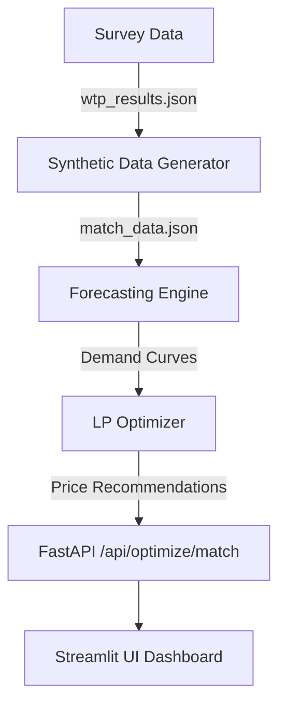

# 🏐 SHV Ticket Pricing Optimization — Solution Overview

This document provides a comprehensive breakdown of the pricing intelligence system built for the **Swiss Handball Federation (SHV)**, focusing on readiness for the **Quickline Handball League** and **EHF EURO 2028**.

---

## 1. Executive Summary (For Clients & Managers)
The SHV Pricing System is an **AI-driven revenue engine** that replaces static, historical pricing with dynamic, fan-centric optimization.

### **Core Value Proposition**
*   **Scientific Accuracy**: Replaces "gut-feel" pricing with Bayesian fan preference models.
*   **Precision Forecasting**: Achieves **5.2% MAPE** (Mean Absolute Percentage Error) on match demand using a hybrid 2-layer ML architecture.
*   **Revenue Maximization**: Delivers an estimated **21-23% revenue uplift** per match while maintaining a strict **60% attendance floor**.
*   **Live Resilience**: Dynamically adjusts prices based on real-time signals like "Booking Velocity" and "Secondary Market Premiums."

---

## 2. How it Works: The Three Engines
The solution is built on a "Three-Pillar" mathematical pipeline:

### **Engine A: Bayesian Conjoint Analysis**
*   **Purpose**: To understand what fans *actually* value.
*   **Algorithm**: **HB-MNL (Hierarchical Bayes Multinomial Logit)** via PyMC.
*   **Output**: 
    *   **WTP (Willingness-to-Pay)**: Quantifies the CHF value of attributes (e.g., "Elite Opponent" = +CHF 42.84).
    *   **Price Bounds**: Sets the scientific Floor and Ceiling for each seating zone.
    *   **Fan Segmentation**: Clusters respondents into 4 personas: *Premium Seeker, Value Loyalist, Atmosphere Seeker, and Occasional Neutral.*

### **Engine B: Demand Forecasting**
*   **Purpose**: To predict exactly how many tickets will sell.
*   **Algorithm**: A Hybrid Two-Layer model.
    *   **Layer 1 (Time Series)**: Uses **STL Decomposition** and **SARIMAX** for sequential trends, plus **DTW (Dynamic Time Warping) Clustering** to identify booking archetypes.
    *   **Layer 2 (ML)**: Uses **LightGBM** and **Neural Prophet** to refine predictions based on live signals.
*   **Output**: P10/P50/P90 probability curves per seating zone.

### **Engine C: LP Price Optimizer**
*   **Purpose**: To find the "Sweet Spot" price that maximizes revenue.
*   **Algorithm**: **Linear Programming (PuLP)** with binary variables for piecewise linear approximations.
*   **Inputs**: Forecasted demand, Conjoint price bounds, and 8 strict constraints.
*   **Output**: CHF 12.00 to CHF 146.00 recommendations with automated approval tiers (Auto, Manager, VP).

---

## 3. Technical Implementation (For Developers)

### **Architecture: FastAPI + Streamlit**
The system is designed as a modular **Headless API** with an interactive **Analytical Frontend**.

### **Tech Stack**
*   **Backend**: Python 3.11+, FastAPI, Uvicorn.
*   **Core Math**: 
    *   **Bayesian**: PyMC 5.10, ArviZ.
    *   **ML**: LightGBM, Neural Prophet, Scikit-Learn.
    *   **LP Ops**: PuLP (Coin-OR CBC Solver).
    *   **Time Series**: Statsmodels, Dtaidistance.
*   **Frontend**: Streamlit, Plotly (Dynamic charts), Pandas (Data processing).

### **Key Resilience Features**
*   **Feature Alignment Layer**: Automatically handles partial input from "Live Signals" by aligning them with the 23-feature training schema.
*   **MinT Reconciliation**: Ensures hierarchical consistency where zone-level sales always sum perfectly to the venue total.
*   **Governance Override**: Hardcoded logic for the **Standing Zone** (min CHF 12.00) to protect the traditional fan base.

---

## 4. The Live Signal Loop
The most powerful feature for the SHV is the **Live Signal Simulator**:

1.  **Velocity Check**: If tickets sell 2.5x faster than normal (T-14), the model detects a "Hot Event."
2.  **Surge Pricing**: The LP Optimizer instantly moves the Standing and Upper prices $3-5 CHF higher.
3.  **Result**: The SHV captures the **Consumer Surplus** without hitting the capacity "Wall" prematurely, maximizing both yield and stadium atmosphere.

---

**System Status**: 🟢 Fully Operational | **Last Verification**: March 24, 2026
